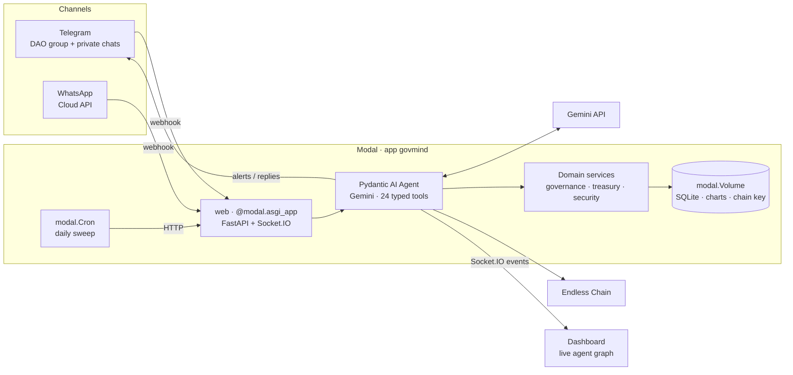

<p align="center">
  
  
  
  
  
  
</p>

<h1 align="center">GovMind</h1>
<h3 align="center">An autonomous AI governance operator for DAOs, living in your Telegram group</h3>

<p align="center">
  One Pydantic AI agent on Gemini · 24 typed tools · four capabilities · real-time dashboard · deployed on Modal
</p>

<p align="center">
  <b>Live demo:</b> <a href="https://driftypencil--govmind-web.modal.run">driftypencil--govmind-web.modal.run</a> ·
  <b>Bot:</b> <a href="https://t.me/GovMind_bot">@GovMind_bot</a> ·
  <b>Architecture PDF:</b> <a href="docs/GovMind-Architecture.pdf">docs/GovMind-Architecture.pdf</a>
</p>

---

## Contents

- [The problem](#the-problem)
- [What GovMind does](#what-govmind-does)
- [How it works](#how-it-works)
- [Try the live demo](#try-the-live-demo)
- [Quick start (local, 5 minutes)](#quick-start-local-5-minutes)
- [Full setup](#full-setup)
- [Configuration reference](#configuration-reference)
- [Deploying to Modal](#deploying-to-modal)
- [Testing](#testing)
- [Repository layout](#repository-layout)
- [Documentation](#documentation)
- [Tech stack](#tech-stack)
- [Limitations and honest notes](#limitations-and-honest-notes)

## The problem

DAOs collectively manage billions in assets, but their governance runs on apathy:

| Problem | Impact |
|---|---|
| **Voter apathy** | Under 10% of token holders vote. Proposals moving millions pass with a handful of votes. |
| **Treasury mismanagement** | Nobody watches burn rate or runway until it's too late. |
| **Governance attacks** | Attackers quietly accumulate tokens, then pass a proposal that drains the treasury. |
| **Information asymmetry** | Only a few insiders read proposals; everyone else rubber-stamps or ignores them. |

Voting tools handle the mechanics, analytics dashboards need SQL, and chat bots repost raw proposal text. **GovMind makes every member an informed participant, in the chat app they already use.**

## What GovMind does

GovMind is one agent that sits in the DAO's Telegram group (and can also answer on WhatsApp), with four capabilities:

1. **Proposal intelligence.** Summarises each proposal, calculates its treasury impact ("80 EDS, 56% of the treasury"), profiles the proposer's wallet (age, funding source, history), rates the risk, and posts a structured briefing.
2. **Vote mobilisation.** Finds members who haven't voted and sends each a personal nudge. It never tells anyone how to vote.
3. **Treasury health.** Tracks balances, burn rate, runway and concentration risk, raises alerts when thresholds are crossed, and sends charts.
4. **Governance attack detection.** Looks for coordinated wallet funding, token accumulation before votes, fresh wallets that vote, and suspicious proposals, then posts a 🚨 **GOVERNANCE ALERT** with evidence. Members get it as a push notification on their phones.

Governance actions (creating proposals, casting votes, alerts) are also recorded on **Endless Chain** as an audit trail.

## How it works



1. A **trigger** arrives: a Telegram or WhatsApp message, a dashboard button, a newly submitted proposal, or the daily cron sweep.
2. The runner builds a **Pydantic AI `Agent`** with GovMind's system prompt, Gemini, and 24 tools. Each tool's arguments are a **Pydantic model**: its JSON schema is what Gemini sees, and the same model validates Gemini's arguments before the tool runs.
3. The runner steps the agent with `agent.iter()`. Each tool call and result is pushed to the dashboard over **Socket.IO**, which lights up nodes and draws edges in the live graph.
4. The agent posts its answer, brief or alert to the **Telegram group** and to every member who subscribed in a private chat, and the run completes on the dashboard.

Full details, with diagrams: **[docs/ARCHITECTURE.md](docs/ARCHITECTURE.md)** and the **[architecture PDF](docs/GovMind-Architecture.pdf)**.

## Try the live demo

1. Open **https://driftypencil--govmind-web.modal.run**.
2. Optional, to get alerts on your phone: open **[@GovMind_bot](https://t.me/GovMind_bot)** in Telegram and tap **Start** (or add the bot to a group).
3. Click **Reset Demo**, then **Run Full Demo Sequence**. It runs four steps back to back (about 2 minutes):

| Step | What happens |
|---|---|
| 1 | Alice asks "is proposal 49 safe to vote for?" The agent investigates and replies. |
| 2 | An attacker wallet submits proposal #50 (70 EDS). GovMind flags it, and a 🚨 alert goes out on Telegram. |
| 3 | An attack scan traces the funding source and the Sybil voting wallets. A second alert goes out. |
| 4 | Bob asks for the treasury runway, and gets a chart. |

The quick-action buttons run each step on its own. [DEMO.md](DEMO.md) has a timed talk track for presenting.

## Quick start (local, 5 minutes)

You need **Python 3.11+**, **Node 20+**, [uv](https://docs.astral.sh/uv/) (or pip), and a **Gemini API key** ([Google AI Studio](https://aistudio.google.com/apikey)).

```bash
git clone https://github.com/Pranavreddy2007/tech-europe-hackathon.git
cd tech-europe-hackathon

# Backend
cd backend
uv venv && source .venv/bin/activate
uv pip install -e ".[dev]"
cp .env.example .env                 # set GEMINI_API_KEY; everything else is optional
python -m govmind.seed               # load the MetaDAO demo data (SQLite)
uvicorn govmind.api:asgi_app --port 8000
```

In a second terminal:

```bash
cd dashboard
npm install
npm run dev                          # http://localhost:3000 (talks to the backend on :8000)
```

Open http://localhost:3000 and click **Run Full Demo Sequence**. Without Telegram or WhatsApp credentials the app runs in **demo mode**: outgoing messages are simulated and shown in the dashboard's live feed.

## Full setup

### 1. Gemini (required)

Create an API key at [Google AI Studio](https://aistudio.google.com/apikey) and set `GEMINI_API_KEY`. The model defaults to `gemini-3.5-flash` with thinking set to `low`, which keeps runs between 13 and 37 seconds. Alternatively, set `PYDANTIC_AI_GATEWAY_API_KEY` to route through the Pydantic AI Gateway.

### 2. Telegram (recommended: real push notifications)

1. In Telegram, message **@BotFather**, send `/newbot`, and copy the token into `TELEGRAM_BOT_TOKEN`.
2. So the bot can read every message in a group (not only mentions and replies), send `/setprivacy` to @BotFather and choose **Disable**.
3. Set `PUBLIC_BASE_URL` to your public backend URL (your Modal URL, or an `ngrok` URL locally). On startup the backend registers its webhook with Telegram automatically.
4. Tap **Start** in a private chat with the bot to subscribe to alerts, and/or add the bot to your DAO group. It introduces itself and learns the group automatically (or set `TELEGRAM_GROUP_ID`).

### 3. WhatsApp (optional)

1. Create an app at [developers.facebook.com](https://developers.facebook.com) and add the **WhatsApp** product.
2. Copy the **Phone number ID**, create an access token, and note the **App secret** (App settings → Basic).
3. Set `WHATSAPP_ACCESS_TOKEN`, `WHATSAPP_PHONE_NUMBER_ID`, `WHATSAPP_APP_SECRET` and a `WHATSAPP_VERIFY_TOKEN` of your choice.
4. In **WhatsApp → Configuration → Webhook**, set the callback URL to `<PUBLIC_BASE_URL>/webhook/whatsapp` with the same verify token, and subscribe to **messages**.

WhatsApp only allows free-form messages within 24 hours of a member's last message. Telegram has no such limit, which is why it's the primary channel.

### 4. Database (optional)

SQLite is used by default. For production, set `DATABASE_URL` to any Postgres URL (Neon, Supabase, …); it's converted to the `asyncpg` driver automatically. Tables are created on startup. Load the demo data with `python -m govmind.seed` locally, or `modal run modal_app.py::seed` on Modal.

### 5. Endless Chain (optional)

With no `ENDLESS_PRIVATE_KEY`, GovMind generates a testnet account, funds it from the faucet, and keeps the key in `ENDLESS_KEY_FILE`, so on-chain audit records work out of the box. On-chain signing uses the official TypeScript SDK through `backend/chain/endless.mjs`, so run `npm install` in `backend/chain` for local on-chain features (the Modal image does this for you). If the Endless RPC is unreachable, a circuit breaker skips on-chain steps for 15 minutes so agent runs never stall.

## Configuration reference

All settings are environment variables (or entries in the `govmind-secrets` Modal secret), read by `pydantic-settings` in [`backend/govmind/config.py`](backend/govmind/config.py).

| Variable | Default | Purpose |
|---|---|---|
| `GEMINI_API_KEY` | none | **Required.** Google Gemini API key |
| `GEMINI_MODEL` | `gemini-3.5-flash` | Gemini model id |
| `GEMINI_THINKING_LEVEL` | `low` | `minimal` / `low` / `medium` / `high`. Higher is slower but more thorough |
| `PYDANTIC_AI_GATEWAY_API_KEY` | none | Use the Pydantic AI Gateway instead of a direct Gemini key |
| `DATABASE_URL` | `sqlite+aiosqlite:///./govmind.db` | Postgres or SQLite URL |
| `TELEGRAM_BOT_TOKEN` | none | Enables the Telegram channel |
| `TELEGRAM_GROUP_ID` | none | DAO group chat id (otherwise learned when the bot is added to a group) |
| `TELEGRAM_WEBHOOK_SECRET` | derived from the token | Secret Telegram echoes back to authenticate webhooks |
| `WHATSAPP_ACCESS_TOKEN` | none | Enables the WhatsApp channel |
| `WHATSAPP_PHONE_NUMBER_ID` | none | WhatsApp sender phone number id |
| `WHATSAPP_VERIFY_TOKEN` | `govmind-verify` | Webhook verification handshake token |
| `WHATSAPP_APP_SECRET` | none | Verifies `X-Hub-Signature-256` on webhooks |
| `WHATSAPP_API_VERSION` | `v21.0` | Graph API version |
| `WHATSAPP_BROADCAST_NUMBERS` | none | Comma-separated numbers that always receive broadcasts |
| `ENDLESS_PRIVATE_KEY` | none | Agent wallet key; if unset a testnet account is generated |
| `ENDLESS_NETWORK` | `testnet` | `testnet` or `mainnet` |
| `ENDLESS_KEY_FILE` | `./endless_agent_key` | Where the auto-generated testnet key is kept |
| `PUBLIC_BASE_URL` | inferred | Public URL, used for chart links and Telegram webhook registration |
| `CHART_DIR` | `./public/charts` | Where generated chart PNGs are written |
| `DASHBOARD_DIR` | none | Static dashboard export to serve at `/` (set on Modal) |
| `SCHEDULED_CHECKS_ENABLED` | `false` | Turns on the daily Modal cron sweep |
| `NEXT_PUBLIC_BACKEND_URL` | same origin / `localhost:8000` | Dashboard: where the backend is |

## Deploying to Modal

```bash
pip install modal && modal setup                  # authenticate once
modal secret create govmind-secrets \
  GEMINI_API_KEY=... TELEGRAM_BOT_TOKEN=... \
  PUBLIC_BASE_URL=https://<workspace>--govmind-web.modal.run
cd backend
modal run modal_app.py::seed                      # demo data onto the volume
./deploy.sh                                       # builds the dashboard, then deploys
```

`deploy.sh` builds the dashboard as a static export (bundled into the image and served at `/`), stops the running app, and deploys. The single web container holds long-lived dashboard websockets, so stopping first swaps versions in about 30 seconds instead of waiting for sockets to time out. What each Modal feature does is described in [docs/ARCHITECTURE.md](docs/ARCHITECTURE.md#how-modal-is-used).

## Testing

```bash
cd backend && pytest
```

16 tests cover the domain services against the seeded data, read-only SQL enforcement, tool-schema validity and argument validation, WhatsApp and Telegram webhook parsing and authentication, Telegram group learning and alert fan-out (group plus private subscribers), cache headers, and the agent loop driven by a scripted Pydantic AI `FunctionModel` (no API key needed). The dashboard is type-checked with `npx tsc --noEmit` and built with `npm run build`.

## Repository layout

```
backend/
  modal_app.py              Modal app: web endpoint, seed job, daily cron
  deploy.sh                 Build dashboard + clean cutover deploy
  govmind/
    api.py                  FastAPI routes: webhooks, /api, /trigger, /charts, dashboard
    agent/
      runner.py             Pydantic AI agent loop, streamed to the dashboard
      tools.py              24 tools, each a Pydantic input model + async handler
      prompt.py             GovMind system prompt (procedures for each capability)
    telegram/               Bot API client, update models, group/private handler
    whatsapp/               Cloud API client, webhook models, shared message handler
    services/               governance, treasury, security, knowledge, charts, blockchain
    messaging.py            Routes sends to Telegram or WhatsApp
    state.py                Learned Telegram groups and subscribers
    events.py               Socket.IO events for the dashboard
    db.py · schemas.py      SQLAlchemy tables · Pydantic result models
    config.py · seed.py     Settings · MetaDAO demo data
  chain/endless.mjs         Endless Chain signer (official TS SDK)
  tests/                    pytest suite
dashboard/                  Next.js dashboard: live agent graph, feed, DAO health, demo controls
docs/                       Architecture, API reference, tech stack, PDF
DEMO.md                     2-minute demo talk track
demo-sequence.sh            Scripted demo from the terminal
```

## Documentation

| Document | What's in it |
|---|---|
| [docs/ARCHITECTURE.md](docs/ARCHITECTURE.md) | Components, agent loop, Pydantic and Modal usage, Telegram design, data model, security, design decisions |
| [docs/API.md](docs/API.md) | Every HTTP endpoint, webhook, Socket.IO event, and all 24 agent tools with parameters |
| [docs/TECH_STACK.md](docs/TECH_STACK.md) | Every framework, API and tool used: version, purpose, and where it's used |
| [docs/GovMind-Architecture.pdf](docs/GovMind-Architecture.pdf) | 7-page architecture brief with diagrams |
| [DEMO.md](DEMO.md) | Timed 2-minute demo script |

## Tech stack

| Layer | Technology |
|---|---|
| Agent | [Pydantic AI](https://ai.pydantic.dev) · Google Gemini (`gemini-3.5-flash`) |
| Typing & validation | [Pydantic v2](https://docs.pydantic.dev) · pydantic-settings |
| Runtime & deploy | [Modal](https://modal.com): ASGI web endpoint, Cron, Volume, Secrets |
| API | FastAPI · python-socketio · httpx |
| Messaging | Telegram Bot API · WhatsApp Cloud API (Meta Graph API) |
| Data | SQLAlchemy 2 (async) · Postgres (asyncpg) / SQLite (aiosqlite) |
| Blockchain | Endless Chain via `@endlesslab/endless-ts-sdk` |
| Charts | matplotlib |
| Dashboard | Next.js 16 · React 19 · Zustand · Socket.IO client · Tailwind CSS 4 · SVG/CSS animations |
| Tests | pytest · pytest-asyncio |

Full list with versions and links: [docs/TECH_STACK.md](docs/TECH_STACK.md).

## Limitations and honest notes

- **Demo data.** MetaDAO's members, proposals, treasury and the attack pattern are seeded demo data, loaded by `seed.py`. On-chain reads, transfers and audit records use Endless testnet.
- **Endless availability.** If the Endless RPC is down, on-chain steps are skipped (and reported by the agent) rather than faked.
- **WhatsApp limits.** Without Meta credentials, WhatsApp runs in demo mode. With them, free-form messages only reach members within WhatsApp's 24-hour window.
- **Single container.** The web function runs on one warm Modal container so agent runs and dashboard sockets share state. That suits a DAO-sized workload; scaling out would need a shared event bus such as Redis pub/sub.
- **Origins.** GovMind was first built at Encode AI London 2026 on Luffa and NestJS. This version is a rewrite for the Tech Europe Hackathon: Python, Pydantic AI, Gemini, Modal and Telegram.
