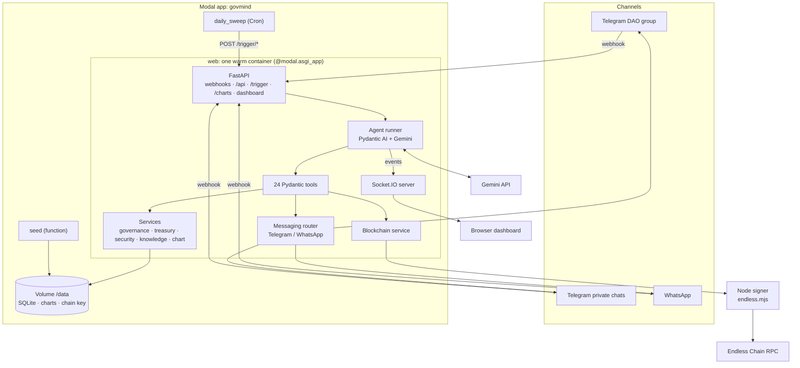
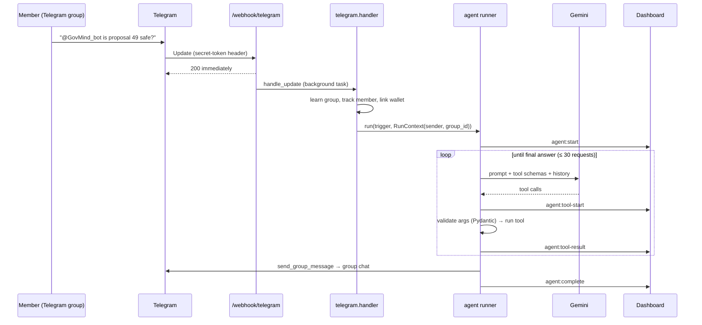

# GovMind architecture

This document explains how GovMind works end to end: the components, the agent loop, how Pydantic and Modal are used, the Telegram design, the data model, security, and the design decisions behind them. A 7-page PDF version with diagrams is in [GovMind-Architecture.pdf](GovMind-Architecture.pdf). Every endpoint, event and tool is listed in [API.md](API.md).

- [1. System overview](#1-system-overview)
- [2. The agent](#2-the-agent)
- [3. How Pydantic is used](#3-how-pydantic-is-used)
- [4. How Modal is used](#how-modal-is-used)
- [5. Channels: Telegram and WhatsApp](#5-channels-telegram-and-whatsapp)
- [6. Endless Chain integration](#6-endless-chain-integration)
- [7. Data model](#7-data-model)
- [8. Real-time dashboard](#8-real-time-dashboard)
- [9. Security and guardrails](#9-security-and-guardrails)
- [10. Performance](#10-performance)
- [11. Testing](#11-testing)
- [12. Design decisions and trade-offs](#12-design-decisions-and-trade-offs)

---

## 1. System overview



Everything server-side lives in one Modal app. The **web** function is a single always-warm container running FastAPI wrapped in a Socket.IO ASGI app. It receives the Telegram and WhatsApp webhooks, serves the dashboard and its API, and runs the agent. Because the agent runs in the same process as the Socket.IO server, every tool call can be streamed to every connected dashboard with no extra infrastructure.

### Request lifecycle (Telegram group question)



## 2. The agent

### 2.1 Triggers

| Trigger | Source | Task given to the agent |
|---|---|---|
| Telegram private message | `/webhook/telegram` | Answer the member privately; broadcast only if the whole DAO needs it |
| Telegram group message | `/webhook/telegram` | Answer in the group (`RunContext.group_id` pins `send_group_message` to that group) |
| WhatsApp message | `/webhook/whatsapp` | Answer the member privately |
| New proposal submitted | `/trigger/submit-proposal`, `/trigger/new-proposal` | Proposal intelligence; urgent alert if risk is HIGH/CRITICAL |
| Dashboard quick actions | `/trigger/*` | Vote check, treasury check, attack scan, questions |
| Daily sweep | `modal.Cron` → `/trigger/attack-check`, `/trigger/vote-check` | Attack scan and vote mobilisation |

Each message trigger includes the sender's member id and name, whether they've linked a wallet, and the last 10 messages of the conversation (per member, or per group), so follow-up questions work.

### 2.2 The loop (`backend/govmind/agent/runner.py`)

1. **Build.** `build_agent()` creates a Pydantic AI `Agent` for this run with the system prompt, the Gemini model (`GoogleModel` + `GoogleModelSettings`, thinking level `low`), and the 24 tools. Each tool is registered with `Tool.from_schema(...)`, using the JSON schema generated from its Pydantic input model. Tool functions are closures over this run's `RunContext`, so a reply goes to the right member or group.
2. **Step.** `_drive()` iterates `agent.iter(...)` node by node. For every `CallToolsNode` it opens `node.stream(ctx)` and forwards `FunctionToolCallEvent` → `agent:tool-start` and `FunctionToolResultEvent` → `agent:tool-result`. This is what animates the graph in real time.
3. **Execute.** Each tool call goes through `tools.execute()`: validate the arguments with the tool's Pydantic model, run the async handler, serialise the typed result with `model_dump(mode="json")`, then truncate it (at most 10 list items at the top level, 300-character strings, depth 3, 2,000 characters total) so large tables never flood the context window.
4. **Finish.** When Gemini replies without tool calls, `agent:complete` carries the final answer and the list of steps.

Limits and safety nets:

- `UsageLimits(request_limit=30)`: Gemini tends to call tools one at a time, so this allows roughly 15–25 tool calls.
- A 240-second timeout around the whole run.
- An `asyncio.Lock` so only one run happens at a time. The dashboard shows one coherent run, and demo steps queue instead of interleaving.
- Any exception ends the run with `agent:error`, so the dashboard can never be left spinning. Tool failures are returned to the model as `{"error": ...}` data, so it can recover or report them honestly.

### 2.3 The system prompt (`agent/prompt.py`)

The prompt carries over the procedures from the original GovMind, adapted for Telegram:

- **Core rules:** one agent (not many); check the knowledge base for team corrections first; never fabricate data; never tell anyone how to vote; only light chat formatting; always finish with `log_action`; be efficient with tool calls.
- **Proposal intelligence:** details → voting status → proposer wallet profile → proposer history (SQL) → treasury impact → briefing in a fixed template (TL;DR, what changes, treasury impact, proposer assessment, who's affected, risk rating, deadline and current votes).
- **Vote mobilisation:** active proposals → non-voters (registered members plus people known on Telegram/WhatsApp) → group reminder → up to 5 personal nudges → summary.
- **Treasury health:** summary → 90-day transactions → compare 30-day burn with the 3-month average → chart → alert if runway is under 6 months, burn is up over 20%, a single transaction is over 10% of the treasury, a new outflow category appears, or concentration is over 75%.
- **Attack detection:** four patterns (accumulation before votes, coordinated funding from one source, fresh wallets, suspicious proposals), each with evidence, severity and recommended actions.
- **Wallets and on-chain:** Base58 or hex address linking; transfers only when explicitly requested or authorised by a passed proposal; on-chain audit records for important decisions.

### 2.4 Tools

24 tools in six groups: governance (8), wallets and chain (5), treasury (2), security (2), messaging (2), utility (5). The full parameter reference is in [API.md](API.md#5-agent-tools-24). Tool names match the dashboard's graph nodes one to one.

Messaging routes by member id: `tg:<id>` → Telegram, digits → WhatsApp (`messaging.py`). `send_group_message` computes its recipients with `broadcast_recipients()`:

- triggered from a Telegram group → **that group only**;
- otherwise (alerts, briefings, scans) → every Telegram group GovMind is in, **and** every private Telegram subscriber (anyone who tapped Start), so each subscriber gets a personal notification even if they're also in the group, plus the WhatsApp list.

## 3. How Pydantic is used

Pydantic is the contract at every boundary: model ↔ tools, backend ↔ dashboard, Telegram/WhatsApp ↔ backend, environment ↔ config.

### 3.1 Pydantic AI runs the agent

```python
agent = Agent(
    GoogleModel("gemini-3.5-flash", provider=GoogleProvider(api_key=settings.gemini_api_key)),
    system_prompt=SYSTEM_PROMPT,
    tools=[Tool.from_schema(call, name=name, description=spec.description,
                            json_schema=spec.json_schema()) for name, spec in TOOLS.items()],
    model_settings=GoogleModelSettings(google_thinking_config={"thinking_level": "low"}),
)
async with agent.iter(prompt, usage_limits=UsageLimits(request_limit=30)) as run:
    async for node in run:
        if Agent.is_call_tools_node(node):
            async with node.stream(run.ctx) as events:
                await stream_to_dashboard(events)     # agent:tool-start / agent:tool-result
```

Pydantic AI handles the Gemini protocol (function calling, thought signatures, retries, usage limits). GovMind steps the graph itself so it can stream events. Switching providers, or routing through the Pydantic AI Gateway, is a configuration change.

### 3.2 Tool inputs: one model, two jobs

```python
class CastVoteArgs(ToolInput):          # ToolInput has ConfigDict(extra="forbid")
    proposal_number: int = Field(description="The proposal number to vote on")
    voter_address: str = Field(description="Wallet address of the voter")
    vote: Literal["for", "against", "abstain"] = Field(description="The vote choice")
    voting_power: float | None = Field(None, description="Voting power (token balance). Default: 1")
```

- `CastVoteArgs.model_json_schema()` (with Pydantic's auto titles stripped) is the schema Gemini sees. `Field` descriptions are the documentation it reads, and `Literal` becomes an enum.
- The same model validates Gemini's arguments before the handler runs. `vote="maybe"` or an invented argument returns `Invalid input for cast_vote: ...` to the model, which then corrects itself.
- A `@tool` decorator registers each handler with its input model, description, and a dashboard label (`lambda a: f'Casting vote "{a.vote}"...'`).

### 3.3 Typed results

Every service returns a Pydantic model from `schemas.py` (`ProposalDetail`, `VotingStatus`, `WalletProfile`, `TreasurySummary`, `NonVoters`, `VoteCast`, `MessageSent`, …), built from SQLAlchemy rows with `from_attributes=True`. One field validator on the base class normalises every datetime to UTC (SQLite drops time zones). Errors are a typed `ToolError`. The agent and the REST API (`/api/health` returns `HealthResponse`) share these definitions.

### 3.4 Webhooks, API bodies and settings

- **Telegram:** `Update`, `Message`, `Chat` (`is_group`), `MessageEntity` (mentions), `ChatMemberUpdated` (bot added to or removed from a group).
- **WhatsApp:** `WebhookPayload` → `Entry` → `Change` → `Value` → `InboundMessage` (text, interactive replies, buttons), with `iter_messages()` pairing each message with its sender's profile name.
- All webhook models ignore unknown fields, so new platform fields never break parsing.
- **API bodies:** every `/trigger/*` endpoint takes and returns a Pydantic model; FastAPI validates it and publishes `/openapi.json` and `/docs`.
- **Settings:** `pydantic-settings` loads configuration from the environment, `.env` or the Modal secret, and converts `postgres://` URLs to the async `postgresql+asyncpg://` driver.

<a id="how-modal-is-used"></a>

## 4. How Modal is used

All compute is defined in [`backend/modal_app.py`](../backend/modal_app.py).

| Modal feature | GovMind usage |
|---|---|
| `modal.App("govmind")` | One app containing all functions |
| `modal.Image` | `debian_slim(python 3.12)` + Node 20 (NodeSource) + `npm install` of the Endless SDK + `uv_pip_install` of Python deps + env vars + the `govmind` package + the statically exported dashboard (`add_local_dir`) |
| `@modal.asgi_app()` `web` | FastAPI wrapped by `socketio.ASGIApp`: webhooks, REST, triggers, charts, dashboard at `/` |
| `@modal.concurrent(max_inputs=100)` | Webhooks, dashboard websockets and API requests are served concurrently while an agent run is in progress |
| `max_containers=1`, `min_containers=1` | Exactly one warm container: no cold starts during a live demo, and runs and sockets share in-process state |
| `scaledown_window`, `timeout` | 15-minute scale-down and 10-minute request timeout (websockets reconnect automatically) |
| `modal.Volume("govmind-data")` at `/data` | SQLite database (when no `DATABASE_URL` is set), chart PNGs, the auto-generated Endless testnet key |
| `modal.Secret("govmind-secrets")` | `GEMINI_API_KEY`, `TELEGRAM_BOT_TOKEN`, `PUBLIC_BASE_URL`, optional WhatsApp and Endless keys |
| `modal.Cron("0 9 * * *")` `daily_sweep` | Calls the web app's `/trigger/attack-check` and `/trigger/vote-check` (resolved with `web.get_web_url()`), so scheduled runs appear on the dashboard and alerts reach Telegram. Opt in with `SCHEDULED_CHECKS_ENABLED=true` |
| `seed` function | `modal run modal_app.py::seed` loads demo data onto the volume and commits it |

**Startup:** the container creates tables, migrates earlier Telegram subscribers into the subscriber list, registers the Telegram webhook with a secret token, and probes Endless in the background.

**Deploys:** `deploy.sh` builds the dashboard, stops the app, and runs `modal deploy`. With a single container holding long-lived websockets, a rolling deploy would wait for those sockets to time out. Stopping first swaps versions in about 30 seconds. Pages are served with `Cache-Control: no-store` and hashed assets as `immutable`, so browsers always load the current build.

## 5. Channels: Telegram and WhatsApp

### Telegram (primary)

The original GovMind lived in a Luffa group chat. The Telegram design keeps that model:

| Behaviour | Implementation |
|---|---|
| Lives in the DAO group | `my_chat_member` (bot added) or the first group message → group saved in `bot_state`; welcome message posted |
| Answers in the group | Group messages run the agent with `group_id`; `send_group_message` posts back to that group |
| Knows the members | Senders, new members and text mentions are tracked as `tg:<user id>` in `group_members` |
| Wallet linking | Hex or Base58 addresses near "wallet/address/link" are linked automatically |
| Private alerts | `/start` subscribes a private chat; every alert also arrives there as a personal notification |
| Quick commands | Reply keyboard: Is proposal 49 safe? · Run attack scan · Treasury status · Who hasn't voted? · Link wallet · Check my EDS balance |
| Formatting | Messages are sent with Telegram Markdown and retried as plain text if the markup is rejected |
| Authentication | `setWebhook` with `secret_token`; requests without the matching `X-Telegram-Bot-Api-Secret-Token` get `401` |

For the bot to read every group message (not only mentions and replies), turn privacy mode off with @BotFather (`/setprivacy` → Disable).

### WhatsApp (secondary)

Meta's Cloud API delivers messages to `/webhook/whatsapp` (HMAC-SHA256 signature verified with the app secret). GovMind replies with text, chart images and an interactive command list ("menu"), and marks messages read. Without credentials, sends are simulated and shown in the dashboard feed, which lets the demo run anywhere. The Cloud API is one-to-one and limits free-form messages to 24 hours after a member's last message, which is why Telegram is the primary channel.

## 6. Endless Chain integration

- **Operations:** read EDS balances, transfer EDS, and write audit records (a 1-octa self-transfer whose transaction timestamps the decision; the summary's SHA-256 is returned alongside).
- **Signer:** Endless only ships a TypeScript SDK, so `chain/endless.mjs` is a small CLI (`balance`, `transfer`, `audit`, `address`, `faucet`) that Python calls as a subprocess, parsing its JSON output into Pydantic models.
- **Agent account:** from `ENDLESS_PRIVATE_KEY`, or generated once, funded from the testnet faucet, and stored on the volume (a `.funded` marker retries funding after an outage).
- **Resilience:** a cached 4-second reachability check, plus a circuit breaker that skips on-chain calls for 15 minutes after any timeout. Startup and demo resets probe the chain in the background. If Endless is down, runs stay fast and the agent reports the skipped step instead of inventing a transaction.

## 7. Data model

SQLAlchemy 2 async models (`db.py`). Postgres in production, SQLite by default. `query_data` lets the agent run read-only SQL over these tables.

| Table | Purpose | Key columns |
|---|---|---|
| `members` | Registered DAO members | `address`, `display_name`, `token_balance`, `join_date`, `whatsapp_id` |
| `group_members` | People GovMind knows on Telegram/WhatsApp | `whatsapp_id` (`tg:<id>` or number), `display_name`, `wallet_address`, `message_count`, `last_seen` |
| `proposals` | Governance proposals | `proposal_number`, `title`, `body`, `proposer_address`, `requested_amount`, `status`, `vote_start`, `vote_end` |
| `votes` | Votes on proposals | `proposal_id`, `voter_address`, `vote`, `voting_power`, `voted_at` |
| `treasury_balances` | Current holdings | `token`, `balance`, `usd_value`, `percentage` |
| `treasury_transactions` | Inflows and outflows | `direction`, `amount`, `token`, `category`, `memo`, `timestamp` |
| `token_transfers` | $GOV movements (attack detection) | `from_address`, `to_address`, `amount`, `timestamp` |
| `knowledge` | Team corrections and definitions | `term`, `definition`, `source_user` |
| `agent_actions_log` | Audit log of agent actions | `action_type`, `trigger`, `reasoning`, `message_sent` |
| `nudge_tracking` | Vote-nudge history | `proposal_id`, `member_address`, `nudge_level` |
| `bot_state` | Learned runtime state | `key` (`telegram_groups`, `telegram_subscribers`), `value` (JSON list) |

**Demo data** (`seed.py`, MetaDAO): 47 members, proposals #40–#49 (with #48 and #49 active), about 6 months of treasury history (142.3 EDS, 2.3-month runway, 82% GOV concentration), and a planted attack. An exchange-funded source wallet funds proposer `9e2b0` and three fresh wallets (`atk001`–`atk003`), which all vote "for" #49. The `/trigger/submit-proposal` demo adds #50 from `atk002`.

## 8. Real-time dashboard

Next.js 16, exported statically and served by the backend at `/`, or run with `npm run dev` against a local backend.

- **Live Feed:** incoming messages (with platform and sender) and outgoing replies and broadcasts (with recipient count and chart images).
- **Agent Neural Graph:** 24 tool nodes in clusters (governance, blockchain, treasury, security, utility, comms, knowledge). `agent:tool-start` highlights a node and animates the traversal edge; the response panel opens on `agent:complete`. Tabs let you replay earlier runs.
- **DAO Health:** treasury, runway, allocation, concentration risk and active proposals, refreshed after every run.
- **Quick Actions:** single steps, **Reset Demo**, and **Run Full Demo Sequence**, which awaits each step so the four steps run back to back.

State lives in a Zustand store fed by `socket.io-client` (`lib/socket.ts`). The backend URL defaults to the page's own origin, so the same build works locally and on Modal.

## 9. Security and guardrails

| Risk | Mitigation |
|---|---|
| Agent-written SQL | `query_data` rejects write keywords and stacked statements, and runs inside a transaction that is always rolled back |
| Invalid or invented tool arguments | Pydantic validation with `extra="forbid"` before any handler runs |
| Forged webhooks | Telegram secret-token header; WhatsApp HMAC-SHA256 signature; `401` otherwise |
| Duplicate deliveries | Message and update ids deduplicated (bounded LRU) |
| Unauthorised transfers | The prompt forbids transfers without an explicit request or a passed proposal; `transfer_eds` requires a positive amount and a reason |
| Voting manipulation by the agent | The prompt forbids telling members how to vote or revealing how others voted |
| Chain outages stalling runs | Reachability check and 15-minute circuit breaker |
| Secret leakage | Secrets only in the Modal secret or `.env` (git-ignored); HTTP client logging silenced so bot tokens never reach logs; auto-generated chain key stored with mode 0600 |
| Stale dashboard after deploys | Pages `no-store`, hashed assets `immutable` |

## 10. Performance

Measured on the live Modal deployment with `gemini-3.5-flash` and thinking level `low`:

| Run | Typical duration | Tool calls |
|---|---|---|
| Member question (WhatsApp/Telegram) | 13–31 s | 7–12 |
| Proposal submitted → alert | 18–32 s | 10–14 |
| Attack scan | 29–47 s | 15–20 |
| Vote mobilisation | 20–37 s | 12 |
| Full 4-step demo | about 2 min | 45–60 |

With Gemini's default thinking level, the same runs took 25–90 s. `low` was chosen for live use.

## 11. Testing

`cd backend && pytest` runs 16 tests against a freshly seeded SQLite database:

- Services against seeded data (active proposals, participation, treasury summary, attack pattern visibility).
- Read-only SQL guard (writes and stacked statements rejected).
- All 24 tool schemas valid, and argument validation rejecting bad input.
- WhatsApp webhook verification, HMAC signatures, payload parsing, interactive replies, wallet extraction.
- Telegram webhook secret, `/start` subscription, alert delivery to subscribers, demo reset keeping subscribers.
- Telegram groups: learning a group, answering in the group, alerts reaching both the group and private subscribers.
- Page cache headers.
- The agent loop driven by Pydantic AI's `FunctionModel`: parallel tool calls, results fed back, events emitted, and errors returned to the model. No API key is needed.

All four dashboard triggers and the full demo sequence were also run end to end against real Gemini on the live deployment.

## 12. Design decisions and trade-offs

- **One agent, many tools** rather than several agents: simpler to reason about, one audit trail, and the graph shows a single coherent investigation.
- **Manual graph stepping** (`agent.iter`) rather than the default run loop: needed to stream each tool call to the dashboard while it happens.
- **A single warm container:** real-time events need the agent and the socket server in one process. Scaling out would need a shared event bus (for example Redis pub/sub) and a shared database (Postgres is already supported).
- **Telegram over WhatsApp as primary:** real group chats and no 24-hour window. WhatsApp stays supported through the same message pipeline.
- **A Node subprocess for Endless:** a pure-Python signer would have meant re-implementing the Endless transaction format; the official SDK is safer.
- **Seeded demo data:** the attack scenario is planted so the demo is reproducible. Every service reads from the database, so a real DAO's data (from an indexer) could be loaded into the same tables.
